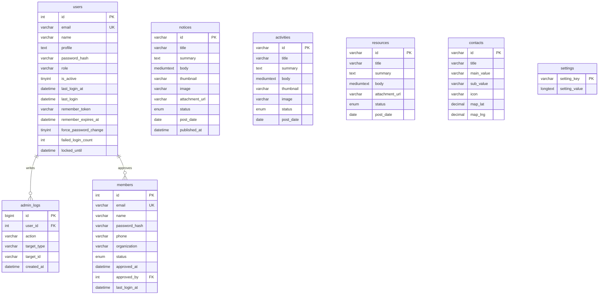

# 과수정 교원노동조합 홈페이지

Cafe24 + PHP 8.x + MySQL/MariaDB 기반 CMS 홈페이지입니다. 기존 Hero Animation, Sidebar, Glass Design, 게시판 리스트 UI는 유지하고 백엔드만 PHP/MySQL 구조로 전환했습니다.

## 구조

```text
/
  index.php
  notice.php
  activity.php
  resource.php
  about.php
  contact.php
  login.php
  signup.php
  mypage.php
  post.php
  admin/
    login.php
    logout.php
    dashboard.php
    notices/
    activities/
    resources/
    contacts/
    settings/
    users/
  api/
    content.php
    notice.php
    activity.php
    resource.php
    contact.php
    login.php
    logout.php
    session.php
    account.php
    users.php
    members.php
  assets/
  config/
  includes/
  uploads/
  install/
    index.php
  database/
    schema.sql
    seed.sql
    migration_admin_auth.sql
    migration_members.sql
```

## Database ERD



## 설치

1. Cafe24 웹 루트에 파일 업로드
2. `/install/index.php` 접속
3. DB 정보와 최초 관리자 계정 입력
4. 설치 완료 후 `/install` 폴더 삭제
5. `/admin/login.php` 접속

수동 설치를 원한다면 `database/schema.sql` → `database/seed.sql` 순서로 import하고 `config/config.php` DB 정보를 수정하세요. 이미 이전 Cafe24 DB를 import한 적이 있다면 `database/migration_admin_auth.sql`과 `database/migration_members.sql`을 추가 실행해 인증 컬럼과 회원 테이블을 보강하세요.

웹 설치에서는 설치 화면에 입력한 관리자 이메일과 비밀번호가 최초 최고관리자로 저장됩니다. 수동 seed 기본 계정은 `admin@example.com / admin1234`이며 첫 로그인 직후 보안을 위해 비밀번호 변경 화면으로 이동합니다.

관리자 화면의 `관리자 계정`에서 추가 관리자 계정을 만들고, `계정 정보`와 `비밀번호 변경`에서 본인 정보를 수정할 수 있습니다.

회원가입은 `/signup.php`에서 신청하고, 관리자가 `/admin/dashboard.php#members`에서 승인하면 `/login.php`와 `/mypage.php`를 사용할 수 있습니다.

자세한 절차는 `CAFE24_SETUP.md`를 참고하세요.

## GitHub 자동 배포

`.github/workflows/deploy-cafe24.yml`이 `main` 브랜치 push 시 Cafe24 FTP로 자동 업로드합니다.

GitHub 저장소의 `Settings` → `Secrets and variables` → `Actions`에 아래 값을 추가합니다.

- `CAFE24_FTP_HOST`: Cafe24 FTP 서버 주소
- `CAFE24_FTP_USERNAME`: Cafe24 FTP 아이디
- `CAFE24_FTP_PASSWORD`: Cafe24 FTP 비밀번호
- `CAFE24_SERVER_DIR`: 업로드할 웹 루트 경로, 보통 `/www/`

서버별 DB 비밀번호가 들어가는 `config/config.php`, `config/database.php`와 사용자가 업로드한 `uploads/` 파일은 자동 배포에서 제외됩니다.

## 백업/복원

- 백업: DB export + 전체 파일 + `uploads/`
- 복원: 파일 업로드 + DB import + `uploads/` 복사 + `config/config.php` 수정
